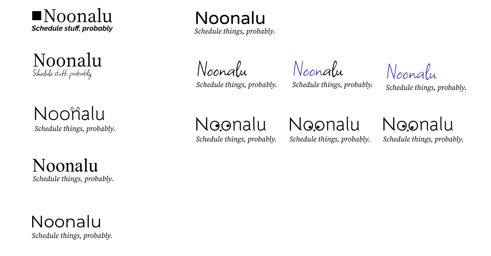

# Noonalu

An iOS app that uses [noonalu-backend](https://github.com/peterkos/noonalu-backend) to optimize [when2meet](https://www.when2meet.com/) for mobile!

A fun side project. Well, hopefully fun.

## Status

Mainly scaffolding at the moment. Here's a brief look at some Figma / branding info:

